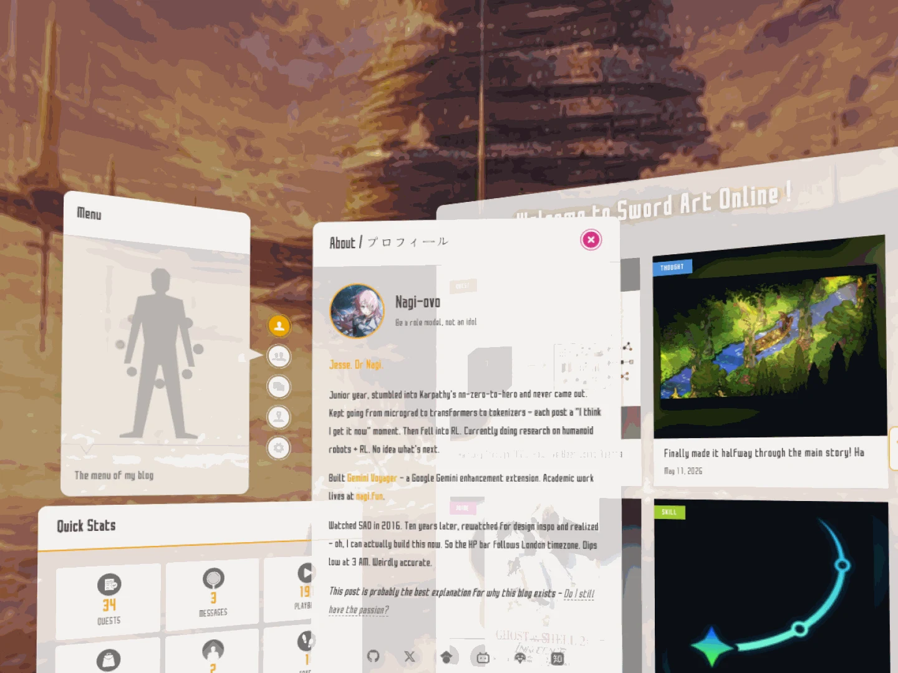

# SAO personal blog theme

一份用于生成完整 SAO 游戏系统风格个人博客主题的实现型 Prompt。

它不是单张首页概念图提示词，而是覆盖以下页面与状态：

- 桌面端首页与移动端首页
- 游戏式主菜单、子菜单、Quick Stats 与 Message
- Quest 文章归档
- 长文章阅读页与专注阅读模式
- Skills、Items、Trace、Map、Graph 等内容页面
- 亮色、暗色、响应式和 reduced-motion
- 可选的 3D / VR 环形窗口模式

## Example result

这张截图只用于展示 Prompt 所描述的视觉结果。案例不包含原项目源码、仓库地址或实现文件。

## Use

[`prompt.zh-CN.md`](prompt.zh-CN.md) 是一份自包含的实现规格。布局、色彩、组件、动效、响应式和验收要求都直接写在 Prompt 中，不要求额外参考页面。

建议分两轮执行：

1. 先完成设计 token、App Shell、菜单、首页和一个文章页。
2. 通过桌面与移动截图确认方向后，再扩展到全部内容页面和 VR 模式。

## Scope boundary

本案例公开的是作者写出的设计意图和实现 Prompt，不公开原博客源码。SAO 名称、角色、字体与界面素材可能涉及第三方权利；用于独立项目时应替换为自有品牌和有权使用的素材。
